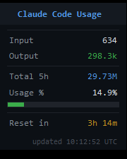

# Claude Code Usage HUD

A lightweight floating desktop widget that shows your **Claude Code token usage**, **session % used**, and **reset timer** in real time — for all Claude plans.

---

## What it shows

| Field | Description |
|---|---|
| Input | Input tokens used in the last 5 hours |
| Output | Output tokens used in the last 5 hours |
| Total 5h | Combined token sum for the current window |
| Usage % | % of your plan's output-token limit (progress bar) |
| Reset in | Countdown until the 5-hour usage window resets |

The progress bar turns **yellow** above 60% and **red** above 85%.

---

## Supported Plans

Click the plan buttons at the bottom of the HUD to switch. Your selection is saved automatically.

| Plan | Output token limit (5h) |
|---|---|
| Free | ~44,000 |
| Pro | ~370,000 |
| Max 5× | ~1,850,000 |
| Max 20× | ~7,400,000 |

> Limits are calibrated from real sessions. If your % doesn't match `claude.ai → Settings → Usage`, open `claude_hud.py` and adjust the value for your plan in the `PLANS` dict.

---

## Requirements

- Windows 10 / 11
- [Python 3.8+](https://www.python.org/downloads/) — check "Add to PATH" during install
- [Claude Code](https://claude.ai/code) installed and used at least once

No extra Python packages — standard library only.

---

## Installation

1. Download or clone this repo
2. Double-click **`start_hud.bat`** to launch

The window appears in the top-right corner. **Drag** to move. **Right-click** to close.

---

## Auto-start with Windows

1. Press `Win + R`, type `shell:startup`, press Enter
2. Right-click `start_hud.bat` → **Create shortcut**
3. Move that shortcut into the Startup folder

---

## How it works

Claude Code stores every conversation as `.jsonl` files in `~/.claude/projects/`.  
The HUD reads those files, sums up **output tokens** from the last 5 hours, and calculates when the oldest message in the window expires — that's the reset time.

No API calls. No internet connection. Fully local.

---

## Files

| File | Purpose |
|---|---|
| `claude_hud.py` | Main script |
| `start_hud.bat` | Launch without a console window |
| `stop_hud.bat` | Kill the HUD |
| `hud_config.json` | Auto-created, saves your selected plan |

---

## License

MIT — do whatever you want with it.
